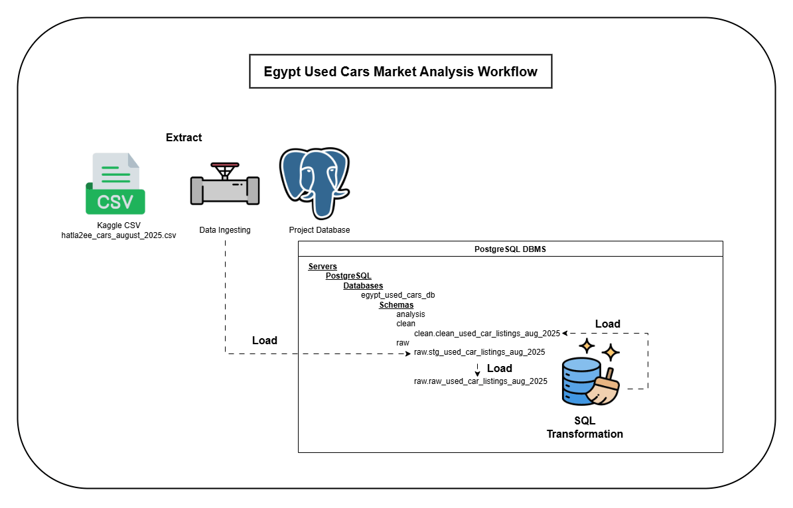

# Egypt Used Cars Market Insights — SQL Analysis Project

This project analyzes used-car listings in the Egyptian market to understand how listed prices vary by manufacturing year, mileage, budget segment, and common company/model combinations.

The goal is to turn raw marketplace listings into practical insights for buyers and sellers using SQL, data quality checks, and a clean analysis-ready table.

> **Important limitation:** this project analyzes listed asking prices, not confirmed sold prices.

## Project Workflow Diagram



## Workflow

```text
Raw CSV
→ Load to staging table
→ Add metadata and preserve raw records
→ Build raw table
→ Apply SQL transformation + quality flags
→ Build clean analysis table
→ Run analysis queries
→ Document findings
```

The current SQL phase uses two main database schemas:

```text
raw    → preserves source data
clean  → stores cleaned analytical fields and quality flags
```

> An analysis schema is reserved for the next phase, where the clean table can be modeled into reporting-ready tables or views for Power BI.

---

## Project Roadmap

- [x] Phase 1 — SQL Analysis: data cleaning, quality flags, validation, and business analysis
- [ ] Phase 2 — Data Modeling: dimensional model for reporting layer
- [ ] Phase 3 — Power BI: interactive dashboard for buyers and sellers

## Project Objectives

This project answers questions such as:

- How does manufacturing year affect listed price?
- How does mileage affect listed price?
- What options are available within different buyer budget segments?
- Which company/model combinations appear most often in each budget segment?
- How can sellers benchmark their asking price against similar listings?
- How can sellers choose a pricing position depending on urgency?

---

## Dataset

The dataset contains used-car listings from the Egyptian market and is available on Kaggle:

[Used Cars in Egypt 2025 Dataset](https://www.kaggle.com/datasets/mohamedsewid/used-cars-in-egypt-2025/data)

Each row represents one listed car and includes fields such as company, model, manufacturing year, mileage, listed price, color, transmission, location, features, and listing/detail link.

---

## Tools Used

- PostgreSQL
- pgAdmin
- SQL
- Git / GitHub
- Excel

---

## Key Data Quality Decisions

| Area         | Issue Found                                                   | Handling                                           |
| ------------ | ------------------------------------------------------------- | -------------------------------------------------- |
| Price        | Text values with commas and `EGP`; suspicious low/high prices | Converted to numeric and flagged                   |
| Mileage      | Text values with `Km`; missing and suspicious values          | Converted to numeric and flagged                   |
| Year         | Unrealistic years such as very old or future values           | Valid years converted; invalid years flagged       |
| Duplicates   | Repeated `detail_link` values                                 | Kept records and added duplicate flags             |
| Location     | Some suspicious values looked like car names                  | Flagged and excluded from broad analysis           |
| Transmission | Very low coverage                                             | Kept for traceability, excluded from main analysis |

---

## Key Findings

### 1. Sellers can benchmark asking prices using quartile-based pricing zones

- The project creates seller benchmarks by comparing similar listings using company, model, manufacturing year, and mileage category.

- Q1 to Q3 defines the normal competitive range, while IQR-based boundaries help flag unusually low or high listings.

### 2. Each buyer budget segment has a distinct set of common company/model options

- Buyers can identify realistic options within their budget segment instead of only looking at a price ceiling.

- Lower budget segments are dominated by older, higher-mileage economy cars, while higher budget segments include newer and more expensive company/model combinations.

### 3. The low-budget segment has the highest listing count

- The low-budget segment contains **7,164 analysis-ready listings**, making it the most available and competitive segment in the dataset.

- This matters for both buyers and sellers: buyers have more options to compare, while sellers face more competition.

### 4. Manufacturing year and mileage both affect listed price, but neither explains price alone

- Newer cars and lower-mileage cars generally have higher listed prices.

- However, wide price gaps within the same manufacturing year show that company, model, mileage, condition, trim, and outlier listings also strongly influence price.

### 5. Data quality issues were handled with flags instead of silent deletion

- The raw dataset contained missing values, invalid years, suspicious prices, suspicious mileage values, and duplicate listing links.

- Instead of deleting these rows immediately, the clean layer preserved them and added quality flags.

- This keeps the analysis consistent, auditable, and transparent.

---

## Project Files

### SQL Scripts

Run these files in order to reproduce the database workflow.

| Order | File                                 | Purpose                                   |
| ----: | ------------------------------------ | ----------------------------------------- |
|     1 | `sql/00_database_setup.sql`          | Create the database and schemas           |
|     2 | `sql/01_create_raw_table.sql`        | Create the raw table                      |
|     3 | `sql/02_import_raw_data.sql`         | Import the CSV into PostgreSQL            |
|     4 | `sql/03_raw_data_quality_checks.sql` | Profile raw data quality issues           |
|     5 | `sql/04_create_clean_table.sql`      | Create the clean analysis table           |
|     6 | `sql/05_insert_clean_data.sql`       | Insert, clean, flag, and validate records |
|     7 | `sql/06_analysis_questions.sql`      | Answer the business analysis questions    |

### Documentation

Read these files in order to understand the project decisions and findings.

| Order | File                                                    | Purpose                                    |
| ----: | ------------------------------------------------------- | ------------------------------------------ |
|     1 | `docs/00_project_framework.md`                          | Project workflow and methodology           |
|     2 | `docs/01_project_brief.md`                              | Business goal, audience, and scope         |
|     3 | `docs/02_raw_data_audit.md`                             | Initial inspection of the raw dataset      |
|     4 | `docs/03_raw_table_design.md`                           | Raw table design and import strategy       |
|     5 | `docs/04_raw_data_quality_checks_plan.md`               | Planned raw data quality checks            |
|     6 | `docs/05_raw_data_quality_findings.md`                  | Raw data quality results                   |
|     7 | `docs/06_clean_layer_design.md`                         | Clean table design and quality-flag logic  |
|     8 | `docs/07_clean_data_validation_findings.md`             | Clean table validation results             |
|     9 | `docs/08_analysis_findings.md`                          | Final business findings and interpretation |