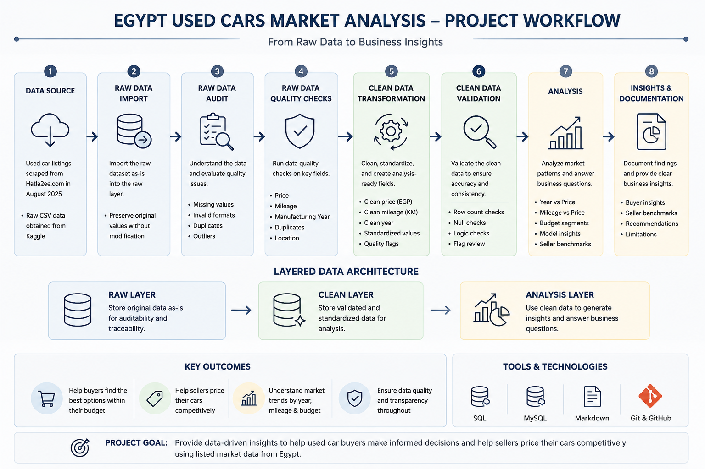

# Egypt Used Cars Market Analysis — SQL Portfolio Project

This project analyzes used-car listings from the Egyptian market to understand how listed prices vary by manufacturing year, mileage, budget segment, and common company/model combinations.

The project follows a SQL-first workflow: raw data import, data quality checks, clean table design, analysis-ready filtering, and business findings for buyers and sellers.

> **Important limitation:** this project analyzes listed asking prices, not confirmed sold prices.

---

## Project Workflow Diagram




## Project Roadmap

- [x] Phase 1 — SQL Analysis: data cleaning, quality flags, validation, and business analysis
- [ ] Phase 2 — Data Modeling: dimensional model for reporting layer
- [ ] Phase 3 — Power BI: interactive dashboard for buyers and sellers


## Project Objectives

This project answers questions such as:

- How does manufacturing year affect listed price?
- How does mileage affect listed price?
- What options are available within different buyer budget segments?
- Which company/model combinations appear most often in each budget segment?
- How can sellers benchmark their asking price against similar listings?
- How can sellers choose a pricing position depending on urgency?

---

## Dataset

The dataset contains used-car listings from the Egyptian market and is available on Kaggle:

[Used Cars in Egypt 2025 Dataset](https://www.kaggle.com/datasets/mohamedsewid/used-cars-in-egypt-2025/data)

Each row represents one listed car and includes fields such as company, model, manufacturing year, mileage, listed price, color, transmission, location, features, and listing/detail link.

Raw CSV and ZIP files are not included in this repository. To reproduce the project, download the dataset from Kaggle and place the raw file inside:

```text
data/raw/
```

---

## Tools Used

- PostgreSQL
- pgAdmin
- SQL
- Git / GitHub
- Markdown

---

## Workflow

```text
Raw CSV
→ Raw PostgreSQL table
→ Raw data quality checks
→ Clean analysis table
→ Analysis-ready filtering
→ SQL business analysis
→ Documented findings
```

The project uses two main database schemas:

```text
raw    → preserves source data
clean  → stores cleaned analytical fields and quality flags
```

The clean layer keeps suspicious records instead of deleting them immediately. Quality flags explain whether a row has valid, missing, suspicious, invalid, or duplicated values.

Default analysis filter:

```sql
WHERE is_analysis_ready = TRUE
```

---

## Key Data Quality Decisions

| Area | Issue Found | Handling |
|---|---|---|
| Price | Text values with commas and `EGP`; suspicious low/high prices | Converted to numeric and flagged |
| Mileage | Text values with `Km`; missing and suspicious values | Converted to numeric and flagged |
| Year | Unrealistic years such as very old or future values | Valid years converted; invalid years flagged |
| Duplicates | Repeated `detail_link` values | Kept records and added duplicate flags |
| Location | Some suspicious values looked like car names | Flagged and excluded from broad analysis |
| Transmission | Very low coverage | Kept for traceability, excluded from main analysis |

---

## Scope Decision: Model Normalization

During analysis, some results revealed source-level naming and parsing limitations, especially around company/model values.

Examples include multi-word brands and model families such as Land Rover, Ssang Yong, Great Wall, Alfa Romeo, and related model names that may be split or grouped differently in the source data.

I explored this issue as a potential clean-layer v2 improvement, but decided not to include it in the current public release. Fully solving it would require a separate normalization layer for brands, model families, and title parsing rules.

For this SQL portfolio phase, the official analysis keeps source-listed company/model names for transparency and documents model normalization as future work.

---

## Key Findings

### 1. Sellers can benchmark asking prices using quartile-based pricing zones

The project creates seller benchmarks by comparing similar listings using company, model, manufacturing year, and mileage category.

Q1 to Q3 defines the normal competitive range, while IQR-based boundaries help flag unusually low or high listings. This turns SQL analysis into a practical pricing guide for sellers.

### 2. Each buyer budget segment has a distinct set of common company/model options

Buyers can identify realistic options within their budget segment instead of only looking at a price ceiling.

Lower budget segments are dominated by older, higher-mileage economy cars, while higher budget segments include newer and more expensive company/model combinations.

### 3. The low-budget segment has the highest listing count

The low-budget segment contains **7,164 analysis-ready listings**, making it the most available and competitive segment in the dataset.

This matters for both buyers and sellers: buyers have more options to compare, while sellers face more competition.

### 4. Manufacturing year and mileage both affect listed price, but neither explains price alone

Newer cars and lower-mileage cars generally have higher listed prices.

However, wide price gaps within the same manufacturing year show that company, model, mileage, condition, trim, and outlier listings also strongly influence price.

### 5. Data quality issues were handled with flags instead of silent deletion

The raw dataset contained missing values, invalid years, suspicious prices, suspicious mileage values, and duplicate listing links.

Instead of deleting these rows immediately, the clean layer preserved them and added quality flags. The main analysis uses:

```sql
WHERE is_analysis_ready = TRUE
```

This keeps the analysis consistent, auditable, and transparent.

---

## Repository Structure

```text
egypt-used-cars-market-analysis/
├── README.md
├── .gitignore
├── data/
│   ├── raw/
│   └── processed/
├── docs/
│   ├── 00_project_framework.md
│   ├── 01_project_brief.md
│   ├── 02_raw_data_audit.md
│   ├── 03_raw_table_design.md
│   ├── 04_raw_data_quality_checks_plan.md
│   ├── 05_raw_data_quality_findings.md
│   ├── 06_clean_layer_design.md
│   ├── 07_clean_data_validation_findings.md
│   ├── 08_analysis_findings.md
│   ├── future_enhancements/
│   │   └── clean_layer_v2_experiment.md
└── sql/
    ├── 00_database_setup.sql
    ├── 01_create_raw_table.sql
    ├── 02_import_raw_data.sql
    ├── 03_raw_data_quality_checks.sql
    ├── 04_create_clean_table.sql
    ├── 05_insert_clean_data.sql
    └── 06_analysis_questions.sql
```

---

## How to Run

Run the SQL files in order:

```text
sql/00_database_setup.sql
sql/01_create_raw_table.sql
sql/02_import_raw_data.sql
sql/03_raw_data_quality_checks.sql
sql/04_create_clean_table.sql
sql/05_insert_clean_data.sql
sql/06_analysis_questions.sql
```

> Local file paths may need to be updated before running the import script.

---

## Project Files

### SQL Pipeline

Run these files in order to reproduce the database workflow.

| Order | File | Purpose |
|---:|---|---|
| 1 | `sql/00_database_setup.sql` | Create the database and schemas |
| 2 | `sql/01_create_raw_table.sql` | Create the raw table |
| 3 | `sql/02_import_raw_data.sql` | Import the CSV into PostgreSQL |
| 4 | `sql/03_raw_data_quality_checks.sql` | Profile raw data quality issues |
| 5 | `sql/04_create_clean_table.sql` | Create the clean analysis table |
| 6 | `sql/05_insert_clean_data.sql` | Insert, clean, flag, and validate records |
| 7 | `sql/06_analysis_questions.sql` | Answer the business analysis questions |

### Documentation

Read these files in order to understand the project decisions and findings.

| Order | File | Purpose |
|---:|---|---|
| 1 | `docs/00_project_framework.md` | Project workflow and methodology |
| 2 | `docs/01_project_brief.md` | Business goal, audience, and scope |
| 3 | `docs/02_raw_data_audit.md` | Initial inspection of the raw dataset |
| 4 | `docs/03_raw_table_design.md` | Raw table design and import strategy |
| 5 | `docs/04_raw_data_quality_checks_plan.md` | Planned raw data quality checks |
| 6 | `docs/05_raw_data_quality_findings.md` | Raw data quality results |
| 7 | `docs/06_clean_layer_design.md` | Clean table design and quality-flag logic |
| 8 | `docs/07_clean_data_validation_findings.md` | Clean table validation results |
| 9 | `docs/08_analysis_findings.md` | Final business findings and interpretation |
| 10 | `docs/future_enhancements/clean_layer_v2_experiment.md` | Future enhancement notes |

---

## Limitations

- The project analyzes listed asking prices, not confirmed sold prices.
- The dataset does not verify car condition, accident history, service history, or trim level.
- Mileage is seller-listed and not independently verified.
- Company/model names are kept as listed in the source data, so some related models may appear separately.
- The `features` field is not fully modeled in the current release.
- No machine learning model or dashboard is included in this SQL phase.

---

## Future Improvements

Possible future improvements include:

- Power BI dashboard development
- dimensional modeling for reporting
- company/model normalization
- feature extraction from the `features` field
- location-based price analysis
- automated monthly data refresh
- comparison between listed prices and actual sold prices if sold-price data becomes available

A clean-layer v2 idea is documented separately as future enhancement work:

```text
docs/future_enhancements/clean_layer_v2_experiment.md
```

---

## Project Summary

This project demonstrates a SQL-first analytics workflow using a real-world used-car dataset. It shows how raw scraped data can be inspected, cleaned, validated, and transformed into business-ready analysis for buyers and sellers.
